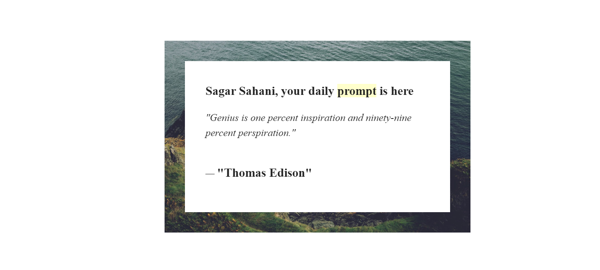

# Daily-prompt

Live demo : https://daily-prompt.herokuapp.com

Prompts are a great way to stay on track for achieving one's goal, whether it is learning something new or getting better at an existing skill.
These prompts usually arrive in your mail box at 10AM(Currently only supports EST)

You get a new quote everyday to keep you motivated

An example of mail body:

The project is build using Node.js, HTML & CSS, also open source API is used to fetch new quotes.
For mailing to all the users, Mailgun is triggered every morning at 10.

Planned Updates to include:

Support for all time zones(taking in the system time)
Personalised messages for specific goals 
